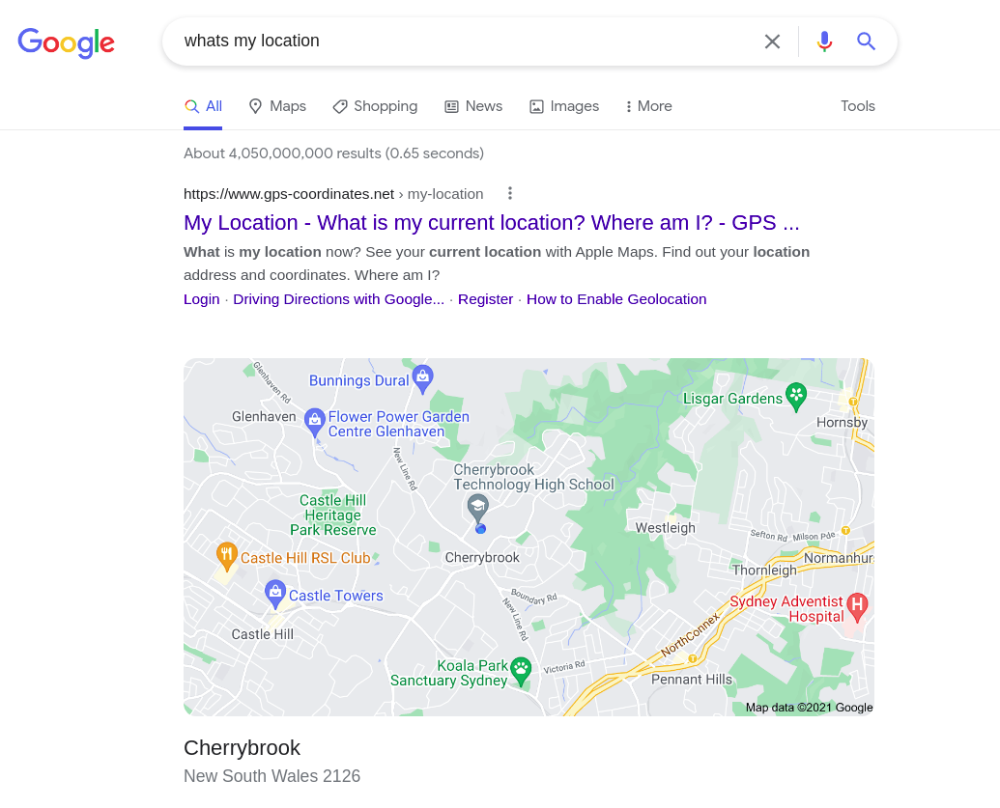
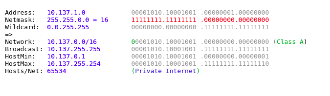

### ©Macauley Lim 2021 -- File Licensed Under The GNU GPLv3. See The Full Notice In License.md For Binding Terms.

# Project Idea - First Proposal - 28th Nov 2021
For the **Science Extension Major Research Project**, I Intend to study the difference in autocomplete results at different geographical areas around the world. This study will be conducted using automated software in order to sample a large number of autocompletes from each location around the world.
# List of Available Regions To Study
| Ashburn, USA         | Atlanta, USA       | Boston, USA             | Charlotte, USA         | Chicago, USA         |
| Cincinnati, USA      | Dallas, USA        | Denver, USA             | Houston, USA           | Las Vegas, USA       |
| Los Angeles, USA     | Miami, USA         | New Orleans, USA        | New York, USA          | Phoenix, USA         |
| San Jose, USA        | Seattle, USA       | Dubai, UAE              | Taipei, Taiwan         | Zurich, Switzerland  |
| Stockholm, Sweden    | Madrid, Spain      | Johannesburg, SA        | Ljubljana, Slovenia    | Bratislava, Slovakia |
| Singapore, Singapore | Belgrade, Serbia   | Bucharest, Romania      | Lisbon, Portugal       | Warsaw, Poland       |
| Lima, Peru           | Oslo, Norway       | Auckland, New Zealand   | Amsterdam, Netherlands | Chisinau, Moldova    |
| Guadalajara, Mexico  | KL, Malaysia       | Luxembourg, Luxembourg  | Riga, Latvia           | Seoul, Korea         |
| Tokyo, Japan         | Milan, Italy       | Tel Aviv, Israel        | Dublin, Ireland        | Mumbai, India        |
| New Delhi, India     | Reykjavik, Iceland | Budapest, Hungary       | Athens, Greece         | Frankfurt, Germany   |
| Bordeaux, France     | Paris, France      | Helsinki, Finland       | Tallinn, Estonia       | Copenhagen, Denmark  |
| Prague, Czechia      | Zagreb, Croatia    | San Jose, Costa Rica    | Bogota, Colmbia        | Santiago, Chile      |
| Montreal, Canada     | Toronto, Canada    | Vancouver, Canada       | Sofia, Bulgaria        | São Paulo, Brazil    |
| Brussels, Belgium    | Vienna, Austria    | Adelaide, Australia     | Brisbane, Australia    | Melbourne, Australia |
| Perth, Australia     | Sydney, Australia  | Buenos Aires, Argentina | Tirana, Albania        | Birmingham, UK       |
| Glasgow, UK          | London, UK         | Manchester, UK          |                        |                      |

As of just having copied out that list from my VPN provider, I may be inclined to limit it some. In order to connect to these servers and limit variables, I will be using a VMWare EXSi hosted cluster and scripting to automatically spin up, set up, perform the experiment and then shutdown the instances of Windows.

I am also still looking into the exact words or terms that I would like to test. These will likely be decided upon a better investigation into the literature below.
| Independent Variables          | Dependent Variables                                                 | Controlled Variables                                                        |
| ------------------------------ | ------------------------------------------------------------------- | --------------------------------------------------------------------------- |
| Location (As from list above), | Characters after text sample, first 10 autocompletes kept in order. | Operating system, web browser, computer specs, account in use, text samples |
# Response #1 - 7th Dec 2021
Very interesting!
How will you know that VPN will trick google's search and be a valid way to location spoof?
Let us get a small scale trial going and see the feasibility for this study.

# Response #2 - 9th Dec 2021
The location spoofing will be confirmed by seeing the results of googling "Whats my location". See attached image. 

I have begun working on the feasibility study. The steps taken so far include:
- Investigated libraries needed to communicate with infrastructure: Listed in LIBRARIES.md
- Prepared operating system for livessh-type booting: Steps taken in IMAGEPREP.md
- Coding in-built library classes

Steps to complete include:
- Investigate asynchronous programming
- Prepare Database for result storage
- Write code for experiment engine (server) with DB
- Test EXSi Cluster
- Write client code with automatic VPN connection, automated experimentation and result collection 
- Run test experiment with small sample

# Technical notes - 13th Dec 2021
IP address space of 10.137.0.0/24

# Ideas with Mr (Name Witheld) - 14th Dec 2021
- Rank which result is first related to covid-19.

**Test from Las Vegas**
1. testosterone
2. test now
3. Testal Mexican Kitchen
4. Restaurant. Phoenix. AZ
5. testicular cancer
6. testicular torsion
7. testosterone booster
8. test now covid
9. testout
10. trrinetarearces reanlarcarssazan?¢ thararmé

**Test from Los Angeles**
1. testosterone
2. test internet speed
3. test my internet speed
4. testicular cancer
5. testicular torsion
6. testimony
7. test statistic calculator
8. testosterone booster
9. ' Testament

**Test from UK, London**
1. Testing for Al
2. test and trace
3. testing for schools
4. test internet speed
5. testosterone
6. testicular torsion
7. test my internet speed
8. testbase
9. tectir ular cancer

**Test from Sydney, Australia**
1. covid cases nsw
2. covid nsw
3. covid testing near me
4. covid testing sydney
5. covid testing parramatta
6. covid restrictions nsw
7. covid cases nsw today
8. covid 19 nsw
9. covid symptoms
10. covid cases victoria

## Update - 15th Dec 2021
First try at automatically setting up the VPN connection today. Seems easy enough working well. Simply calling the openvpn process while experiment is running.

## Update - 16th Dec 2021
The client works fully and now I am working on introducing the socket handling mechanics. This will require the socket library and a server that provides connection handles, managing the order and execution of tasks.

## Update - 23rd Dec 2021
First attempt to make a system to handle the injection of the experiment into the final node. Using pysftp, we upload the folder recursively.

## Update - 31st Dec 2021
The project is now called MAS or Magma Automated Science. Today I have been working on documentating the steps required in order to fully inject and run the experiment. This process can be summarised as:
- VM creation
- VM startup
- Client code injection
- Client code execution
- VPN activation
- Firefox startup
- Data scraping
- VPN disconnection
- VM shutdown
- VM destruction

I am making progress on all parts of this process. Additionally, I have switched from using a socket system to a http based API which allows the design to become asynchronous. Additionally, I have taken a lease from REST-type apis, using the model to design a read-edit-destroy API that makes it easy to implement the system handling the DB end as well as multiple client processors to handle EXSi, injection etc.

Additionally, I wrote the client code to handle the requests to the HTTP api as well. At this stage all VM actions are manual but I am working to use the pyvmomi api to handle this side.

## Update - 1st Jan 2022

I have started working on the VM creation step and have a semi-functioning VM Creator that needs a few more features such as virtual CD addition. The client has come along a bit as well, now featuring proper timing and delays to prevent API overload.

## Update - 3rd Jan 2022
The EXSi API now handles deletion of VMs, as well as shutdown.

## Update - 18th Jan 2022
The EXSi API portion now successfully handles the creation of VMs including virtual CD Drives and network adapters. Additionally, I have added code to allow fetching of the VMs ips from EXSi which will be useful later in the injection code.

## Update - 19 Jan 2022
I am now working on the SSH injector that will actually run the code using the paramikro and fabric libraries. Some serious issues here with allowing my code to continue to run after closing the SSH Connection. Solutions to be found, hopefully.

## Update - 20 Jan 2022
I have removed my VENV as the dependencies need to be installed fresh on the VM anyway, and windows to linux incompatibilities in using the same virtual environment are causing me issues.

## Update - 21 Jan 2022
Today I have succesfully run the code fully for the first time successfully. It has built a VM from scratch, injected it and ran a test code.

## Update - 26 Jan 2022
I can't believe it is actually working fully today. I had some more issues with the fresh install including with a newer version of pytesseract and pip updating to a version incompatible with the version of python on the system. By fixing these steps I am nearly ready to run a multi-sample gatherer test.

## Update - 27 Jan 2022
I have run into performance issues with the pysftp library and so am transition to using fabric for both upload and run steps. Additionally, I may look into using over the wire compression to decrease the file count.

## Update - 28 Jan 2022
Today I started the first big run, collecting results from 48+ countries 5 times with the stimulus "test"

## Update - 29 Jan 2022
After removing non-english results, I have been left with 210 results form 41 countries. This project is now a success and I have a feasibility testing data set as well. From here the project needs to find a strong footing, with a research question to test.

## Update - 3 Feb 2022
I talked to Mr (Name Witheld) more about the Feasibility study-- He is glad it has worked but we need to figure out our analysis steps. I was unable to find a data scientist to help us with the project so I will be on my own.

At this stage, it is looking like a Chi-Squared analysis, comparing covid-19 case numbers to the prevalence of the word "covid" in auto-complete results may be the best way to continue with the project. I plan to meet with Mr (Name Witheld) to discuss this tomorrow during a double free period.

## Update - 4 Feb 2022
As of current I still agree whit my previous Chi-Squared analysis idea.

The hypothesis will be:
### An increased prevalance of Covid-19 infections will correlate with a higher level of Covid-19 related terms in autocomplete results.

My only real question at this point is how to make an expected value for the Chi-Squared analysis. I have a datasource for automatically receiving up-to-date covid-19 infection rates world wide thanks to the John Hopkins University Covid-19 Datasource but I am unsure exactly how to calculate them into a comparable scale or term. More discussion of this is necessary with Mr (Name Witheld).

## Update - 4 Feb 2022 Mr (Name Witheld)
Chi Squared test of independence comparing the number of covid-19 related auto-complete results and the covid-19 case results.

Research Question/Hypothesis:
- Include variables

Compare to number of people getting covid per 100,000

## Update - 28 April 2022
The look now is to find out what terms to search for. For this, I will write a program that goes down the database and records the number of terms to find the most popular ones.

Total results: 1574. 1516 Compliant. 60 Removed as part of Data Cleansing
We have a list:
testosterone: 178
test Internet speed: 97
test my internet speed: 94
testicular cancer: 67
testicular torsion: 45
testing sites near me: 42
testing near me: 39
test: 37
testout: 26
test speed: 25
test cricket: 24
test internet speed: 24
testing near me: 24
test match: 20
testing: 20
test wizard: 20
test grade calculator: 19
testosterone booster: 17
test de embarazo: 15
test ranking: 15
testing sites nyc: 14
testimony: 13
test my Internet speed: 13
testing: 11
test pcr: 11
testflight: 10
test netconnection: 10
testament: 10
test score: 10
test rapldo covld: 10
test de personalldad: 10
test match llve: 10
testbeforeyougo: 10
test antlgeno covld: 9
test match score: 9
test calculator: 9
testing sites houston: 9
testout: 9
testamur: 9
test isolation payment: 8
testis: 8
test covld: 8
testing sites brooklyn: 8
testing clinics near me: 7
testicular cancer: 7
test my internet speed: 7
testosterone booster: 7
testing sites katy: 7
testing Ios angeles: 7
testing for covid: 7
testing texas: 7
testing for covid near me: 7
testdisk: 6
test de antlgenos: 6
test: 6
test Iq: 6
test webcam: 6
testing clinics sydney: 5
test and isolate payment: 5
test4free: 5
testing covid near me: 5
testing covid adelaide: 5
testing covid port adelaide: 5
test isolation payment: 5
testing stations near me: 5
testing stations auckland: 5
testing stations manukau: 5
testing stations: 5
testimony meaning: 5
testing sites chicago: 5
test now: 5
testnav: 5
testing colorado: 5
testing denver: 5
test and protect cincinnati: 5
test and protect: 5
test kit covld: 5
test kit: 5
test kit saliva: 5
test calculator: 5
testing center byui: 5
testosterone supplements: 5
testing clinic near me: 5
testing clinic brisbane: 5
testing clinic gold coast: 5
testing pasadena: 5
test rapid covld: 5
teste auto: 5
test de personalidad: 5
test vocacional: 5
testosterona: 5
test de Iq: 5
test de velocidad de internet: 5
test de las 16 personalldades: 5
testing site near me: 5
testimonial: 4
testing sites newark nj: 4
testing sites union nj: 4
testing sites new jersey: 4
test Isolatlon payment: 4
testing california: 4
testing sites melbourne: 4
test Internet speed: 4
test mbti: 4
testdisk: 4
testis: 3
testing sites norwalk ct: 3
test internet speed: 3
testing clinics Iiverpool: 3
testseala bs: 3
testing colorado: 3
test covld chlslnau: 3
test pcr covld chlslnau: 3
testwizard: 3
testudo times: 3
test covld: 3
testing site mlaml: 3
testing site mlaml beach: 3
test covld near me: 3
test cps: 3
testing sites new york: 3
test de velocidad: 3
testing for covid near me: 2
test and go thalland: 2
testimonial: 2
testpaperfree: 2
test match llve: 2
testing sltes nyc: 2
testing sltes norwalk ct: 2
testing Ias vegas: 2
testing sites nsw: 2
test and isolate payment: 2
testudo times: 2
testnav: 2
test covld Chisinau: 2
test pcr covld Chisinau: 2
testing sites geelong: 2
testing sites: 2
testing sites Jersey clty: 2
testing for covid greensboro nc: 2
testimony: 2
testing callfornia: 2
testing site miami: 2
testing site miami beach: 2
test covid near me: 2
test tube: 1
testing clinics liverpool: 1
tested positive for covid 19: 1
testing sites rhode island: 1
testing sites taunton ma: 1
testing callfornia: 1
test match Ilve: 1
testing for covld near me: 1
test mbtl: 1
testicles: 1
test tube: 1
testosterone meaning: 1
test de antigenos: 1
test antigeno covld: 1
testing clinics parramatta: 1
test my speed: 1
test mbti: 1
testing st louis: 1
testbook logln: 1
test my speed: 1

### And a manually selected list of covid-related terms.
testing sites near me
tesitng near me
testing near me
testing
testing sites nyc
test pcr
test antlgeno covld
test isolation payment
testing sites houston
test covid
testing sites brooklyn
testing clinics near me
testing sites katy
testing Ios angeles
testing for covid
testing texas
testing for covid near me
testing clinics sydney
test and isolate payment
test isolation payment
test4free
testing covid near me
testing covid adelaide
testing covid port adelaide
testing stations near me
testing stations auckland
testing stations manukau
testing stations
testing sites chicago
testing center byui
testing colorado
testing denver
testing sites chicago
test now
test and protect
test kit covld
test kit
test kit saliva
test calculator
testing clinic near me
testing clinic brisbane
testing clinic gold coast
testing pasadena
test rapid covld
testing site near me
testing sites newark nj
tesitng sites union nj
testing sites new jersey
test Isolation payment
testing california
testing sites melbourne
testing colorado
testing site miami
testing site miami beach
test covid near me
testing sites new york
tested positive for covid 19
tested positive

## Refining into key terms
tested
positive
testing
isolation
covid / covld
clinic
pcr

Anything with these I will consider related.

## 19th May 2022
I have coded the KeyWord processor, and now have got the final_result.json file. Now to find the Covid-19 case load for Jan 28th 2022.

## 25th May 2022
I have finished coding up the code that reads in the CSV data from John Hopkins report, and exports an excel capable CSV file for processing using statistical analysis.

## 29th May 2022
I have now performed the ANVOVA and Pearson's analysis on the data. As for the ANOVA, we have found statistical significant below P=0.01.
Unfortunatently, with a Pearsons (R) value of 0.037, there is no good correlation between the variables studied.